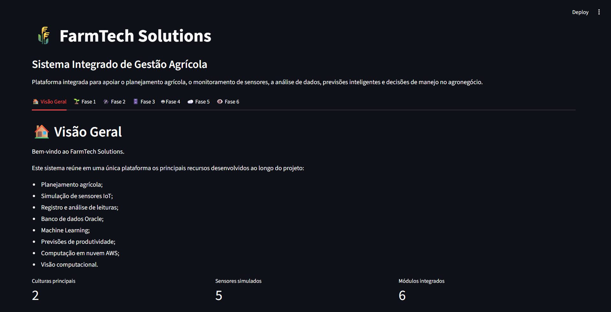
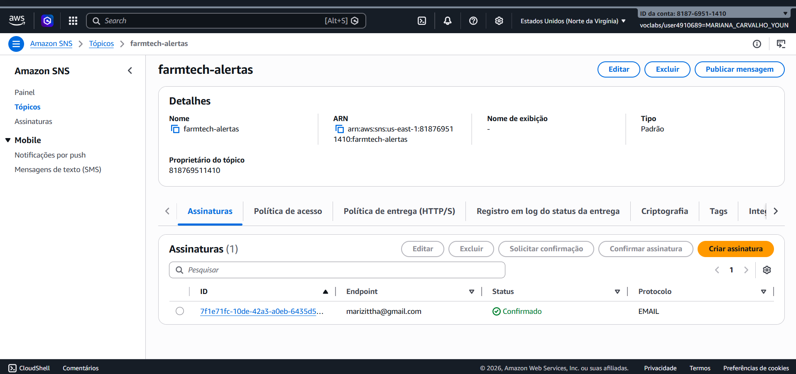
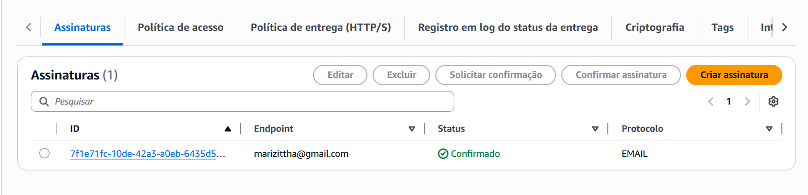
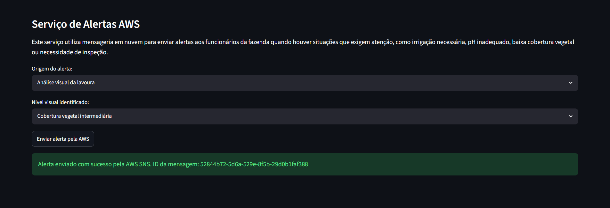
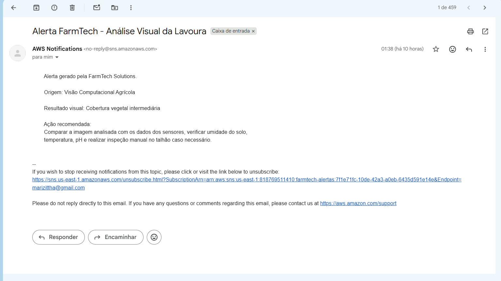

# FIAP - Faculdade de Informática e Administração Paulista

<p align="center">

</p>

<br>

# FarmTech Solutions

## Grupo FarmTech Solutions

## 👨‍🎓 Integrantes:

- Henrique Honorio da Silva – RM 567102  
- João Victor Matos de Paiva – RM 568345  
- Luiz Frederico Nunes Campêlo – RM 567319  
- Manoella Menezes Weiser – RM 567531  
- Mariana Carvalho Youn – RM 568548 

## 👩‍🏫 Professores:

### Tutor(a)

- Sabrina Otoni

### Coordenador(a)

- André Godoi Chiovato

---

# 📜 Descrição

O projeto FarmTech Solutions foi desenvolvido durante o curso de Inteligência Artificial da FIAP com o objetivo de apoiar o monitoramento agrícola por meio da integração de tecnologias modernas de coleta, armazenamento, análise e visualização de dados.

A solução reúne em uma única plataforma funcionalidades desenvolvidas ao longo das fases do projeto, contemplando conceitos de Internet das Coisas (IoT), Banco de Dados, Machine Learning, Computação em Nuvem e Visão Computacional.

A aplicação permite realizar o planejamento agrícola, registrar leituras de sensores simulados, armazenar informações em banco de dados, realizar análises preditivas de produtividade e executar análises visuais da lavoura.

Na Fase 7 foi realizada a integração completa de todas as funcionalidades em uma única dashboard desenvolvida com Python e Streamlit.

Além da integração dos módulos anteriores, foi implementado um serviço de mensageria utilizando Amazon SNS (Simple Notification Service), permitindo o envio automático de alertas por e-mail para os responsáveis pela fazenda.

Os alertas podem ser gerados a partir de:

* Leituras dos sensores IoT;
* Resultados do modelo de Machine Learning;
* Análises visuais da lavoura;
* Alertas manuais cadastrados pelo usuário.

As mensagens enviadas apresentam recomendações de ações corretivas para auxiliar no manejo agrícola e apoiar a tomada de decisões.

---

# 📷 Dashboard Integrada

A figura abaixo apresenta a dashboard final da FarmTech Solutions contendo a integração das funcionalidades desenvolvidas nas Fases 1, 2, 3, 4, 5 e 6.

<p align="center">

</p>

---

# ☁️ Serviço de Alertas AWS SNS

Durante a Fase 7 foi implementado um serviço de mensageria em nuvem utilizando Amazon SNS.

O objetivo do serviço é notificar automaticamente os responsáveis pela fazenda quando forem identificadas situações que exijam atenção, como:

* Necessidade de irrigação;
* Alterações de pH;
* Problemas identificados pela visão computacional;
* Alertas manuais definidos pelo usuário.

O fluxo de funcionamento é:

1. A dashboard gera o alerta;
2. A aplicação envia a mensagem para o Amazon SNS;
3. O SNS encaminha a mensagem para os assinantes cadastrados;
4. O responsável recebe o alerta por e-mail.

---

## Criação do tópico SNS

Foi criado o tópico SNS denominado:

**farmtech-alertas**

Responsável por centralizar o envio de notificações da plataforma.

<p align="center">

</p>

---

## Assinatura confirmada

Foi criada uma assinatura utilizando protocolo EMAIL para recebimento das notificações.

<p align="center">

</p>

---

## Envio de alerta pela aplicação

A dashboard permite o envio de alertas diretamente pela interface integrada.

<p align="center">

</p>

---

## Recebimento do alerta

Após o envio, o responsável recebe automaticamente a mensagem contendo as informações e recomendações geradas pelo sistema.

<p align="center">

</p>

---

# 📁 Estrutura de Pastas

O projeto está organizado da seguinte forma:

```text
FASE7_FARMTECH_SOLUTIONS
│
├── .streamlit
│   └── secrets.toml
│
├── dados
│
├── fase1_gestao_agricola
│
├── fase2_banco_dados
│
├── fase3_machine_learning
│
├── fase4_dashboard_base
│
├── fase5_aws_alertas
│
├── fase6_visao_computacional
│
├── app.py
│
├── requirements.txt
│
└── README.md
```

Descrição das pastas:

* **dados**: armazenamento de informações utilizadas pelo sistema.
* **fase1_gestao_agricola**: funcionalidades relacionadas ao planejamento agrícola.
* **fase2_banco_dados**: armazenamento e consulta de dados agrícolas.
* **fase3_machine_learning**: modelos de previsão e análise de produtividade.
* **fase4_dashboard_base**: dashboard utilizada como base da integração.
* **fase5_aws_alertas**: serviços de computação em nuvem e mensageria AWS.
* **fase6_visao_computacional**: análise visual da lavoura.
* **app.py**: aplicação principal integrada da Fase 7.

---

# 🔧 Como executar o projeto

## Pré-requisitos

* Python 3.11 ou superior
* Visual Studio Code
* Conta AWS Academy
* Amazon SNS configurado
* Streamlit

## Instalação

Clone o repositório:

```bash
git clone [LINK_DO_REPOSITORIO]
```

Entre na pasta:

```bash
cd fase7_farmtech_solutions
```

Instale as dependências:

```bash
pip install -r requirements.txt
```

Configure as credenciais AWS em:

```text
.streamlit/secrets.toml
```

Execute a aplicação:

```bash
streamlit run app.py
```

---

# 🎥 Vídeo de demonstração

Link do vídeo:

[COLE_AQUI_O_LINK_DO_YOUTUBE]

O vídeo apresenta:

* Fase 1 – Gestão Agrícola;
* Fase 2 – Banco de Dados;
* Fase 3 – Machine Learning;
* Fase 4 – Dashboard;
* Fase 5 – AWS SNS;
* Fase 6 – Visão Computacional;
* Integração final da Fase 7.

---

# 🗃 Histórico de lançamentos

## 0.7.0 – Fase 7

* Integração completa das fases.
* Implementação do serviço AWS SNS.
* Dashboard final unificada.

## 0.6.0 – Fase 6

* Implementação de visão computacional.

## 0.5.0 – Fase 5

* Configuração da infraestrutura AWS.

## 0.4.0 – Fase 4

* Desenvolvimento da dashboard.

## 0.3.0 – Fase 3

* Modelos de Machine Learning.

## 0.2.0 – Fase 2

* Banco de Dados.

## 0.1.0 – Fase 1

* Planejamento e gestão agrícola.

---

# 📋 Licença

<p>


MODELO GIT FIAP por FIAP está licenciado sob
<a href="http://creativecommons.org/licenses/by/4.0/">Attribution 4.0 International</a>.
</p>
